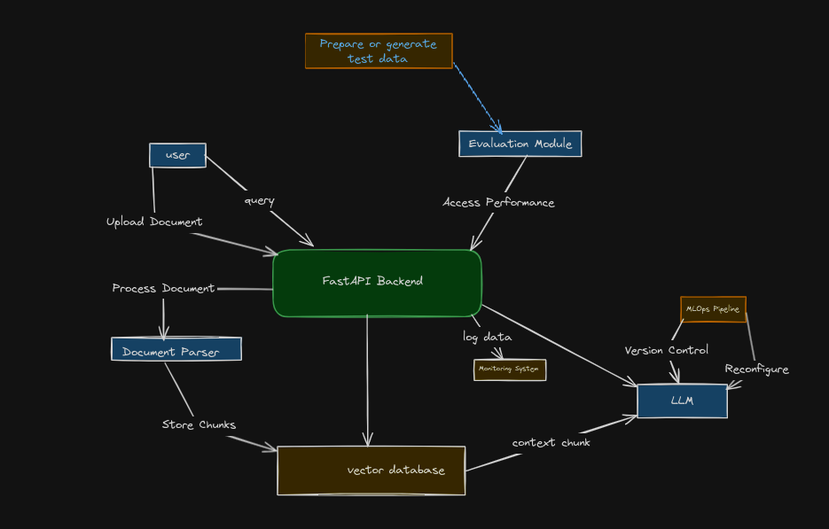
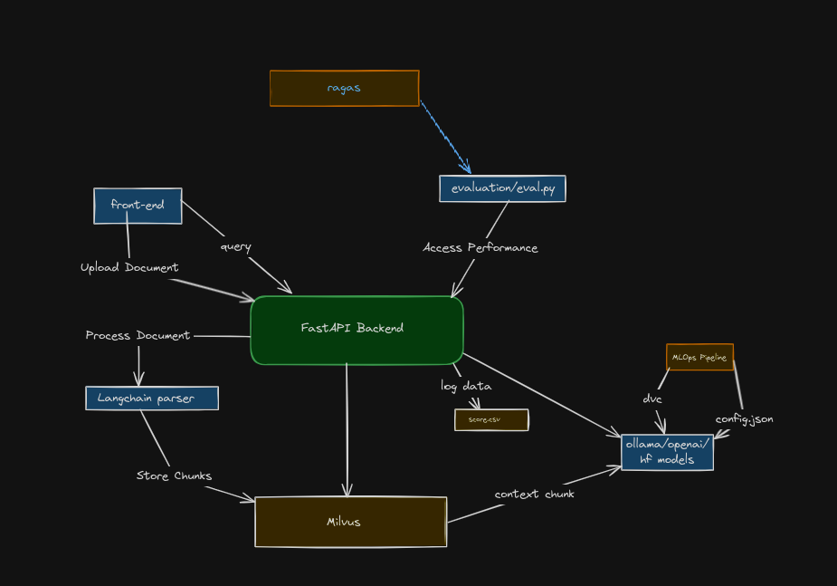

# Contextual Chatbot

This project implements a contextual chatbot that can answer questions based on uploaded documents. It uses FastAPI for the backend, Milvus for vector storage, and GPT-Neo for text generation.


## Usage

1. Upload a document:
   - Click on the "Choose File" button in the "Upload Document" section.
   - Select a PDF or DOCX file from your computer.
   - Click the "Upload" button to process and store the document.

2. Ask questions:
   - Enter your question in the text box in the "Ask a Question" section.
   - Click the "Submit" button to get a response from the chatbot.

3. View chat history:
   - The chat history will be displayed in the section below the query form.


# Setup with docker
```bash
docker-compose up
```

# Setup without docker
```bash
python -m venv .venv
source .venv/bin/activate
pip install -r requirement.txt
sh startup.sh
```

# High Level Design



# Design with components


## Flow: 
- PDF -> Extract Text -> Chunking -> Embedding -> Save to DB
- query -> Embedding -> Search in DB -> Retrieve Releveent Chunks -> LLM -> Response

## Component Overview
1. FastAPI - Used for backend with two endpoints
- `POST /upload`: Upload and process a document (PDF or DOCX)
- `POST /query`: To get response from the llm with query.

2. Front-End
- keep a very simple index.html file which can use used for upload the document, and submit query. The conversational history will also be visible.

3. Performance Evaluation
- Used [ragas](https://arxiv.org/pdf/2309.15217) for synthetic data generation and performance evaluation

4. Vector DB
- Used [Milvus](https://milvus.io/docs/quickstart.md) as a vector db

5. Document Processing
- Used Langchain to parsing and processing the documents.

6. LLM
- I have used openai to generate synthetic data (ragas backend), considering it is a one time things. 
- As a RAG retriever you can use either hugging face model, ollama models and openai models currently. However the module can be easily modified to support any models. 
- I have tested 3 models : 1. ollama llama 3.2 2. openai models 3. HF GPT Neo
- Ollama latency is poor but if we deploy ollama on the server it will be faster. Accuracy wise it is good.
- OpenAI model is accurate with good latency. 
- To Use ollama need to setup ollama locally
- To Use openai need to setup api key in the environment


## Generate the test data

1. keep all the pdf in the /data/pdf folder
2. python evaluation/systhetic_data_generation.py
3. python evaluation/eval.py

```bash
python evaluation/synthetic_data_generate.py --pdf_directory="data/pdfs" --num_questions=12
```

## Steps for new pdf
1. Run `python evaluation/systhetic_data_generation.py` to generate the synthetic test question-answer pairs.
2. Run the service and then `python evaluation/eval.py` to evaluate the service accuracy.


## ML Ops Cycle

New pdf -> Generate QA pairs -> Evaluate -> Update the config -> Evaluate
1. Generate QA pairs (evaluation/systhetic_data_generation.py)
2. Evaluate (evaluation/eval.py)
3. Check the score (score.csv) and update the config (config.py)
4. Repeat 2 and 3

# Files to Track using dvc
1. testset.csv -> evaluation/systhetic_data_generation.py -> Generate the question answer pairs (GT)
2. question_answer.csv -> Intermediary file
3. score.csv -> evaluation/eval.py -> predict and answer and evaluate the model by comparing with GT.
4. config.json -> config.py -> Store the configuration


```json
{
    "chunk_size": 1000, # embedding size of the chunk
    "model_name": "all-MiniLM-L6-v2", # emdedding models
    "embedding_dim": 384,
    "top_k": 3, # num of relevent chunk as a context for retriver
    "retrival_model": "openai" # openai/ollama/gpt-neo
}
```
------------------------------------------------

# TODO
- [x] Flow: pdf -> Extract Text -> Chunking -> Embedding -> Save to DB -> query -> Embedding -> Search in DB -> Retrieve Chunks -> Generate Response
- [x] Build a boilerplate application
- [x] Refactor the code to seperate db and model
- [x] add logger and timer
- [x] Setup evaluation pipeline
- [x] Prepare question answer pairs for evaluation
- [ ] Setup mlops pipeline, versioning:
    - [x] Things to track (Store in DB)
        - [x] Chunk Size
        - [x] Embedding Model name
        - [x] Embedding dimension
    - [ ] Things to track (Retrieve):
        - [x] LLM model name
        - [x] Latency
        - [ ] Accuracy
        - [ ] Cost
- [ ] Streaming response setup
-----------------------
- Unit Testing Response
- gpt x - accuracy not good, respons time ~ 30s, token/s=24.27
- ollama(llama 2.1) - accuracy good, response time - 30s, token/s = 1.9
- gpt4o-mini- accuracy good, response time 4.6s, token/s = 10.6


